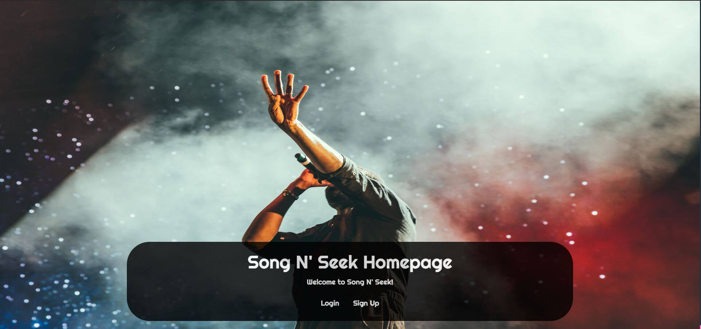

# 🎧 SongNSeek 🎵
A music application utilizing ORM for a customized user experience.
## Link to Deployed Application 🔗

_https://song-n-seek.herokuapp.com/_

## Table of Contents

1. [Project Description](#project-description)
2. [What to Expect From the Application](#What-to-Expect-From-the-Application)
3. [Tech Stack](#Tech-Stack)
4. [Third-Party APIs](#Third-Party-APIs)
5. [Server-side APIs](#Server-side-APIs)
6. [User Story](#User-Story)
7. [Project Roles](#Project-Roles)
8. [Goals for Deployment](#Goals-for-Deployment)
9. [Future Releases](#Future-Releases)
10. [Screenshots](#Screenshots)
11. [References](#References)

## Project Description 

The purpose of this project is to create an application that allows the user to stream music, create playlists, and much more. This will be done using a front-end user interface and front-end/back-end logic. Through the interaction of the front end, a user will be accessing a database to store their encrypted login information, as well as perform Create, Read, Update, and Delete methods for the database.
## What to Expect From the Application

Information in respect to music is being pulled everywhere every day. When you pull up a song on Spotify or Apple Music, information about the track inquired is being pulled at your request. This track information is then displayed to you, while giving the option to save this information to a library in a database.

This project demonstrates the real life application of communication between the front-end (client-side), and the back-end (server-side) when pulling music information. Deezer's API was used to pull information based on the user's search, which is displayed to the user. Once the user selects an option, that selection is saved to a database for storage per the user's library. 

he user will be able to see information in regards to their search, like the artist, album, and song selected. In the future, we plan to use this application for streaming services using auth and request tokens for Deezer users.

## Tech Stack
* Front-end: CSS3/HTML5
* Front-end/back-end logic: Javascript
* Database: MySQL
* ORM: Sequelize 
* Template engine: Handlebars.js
* Server: Express.js via Node.js

### Third-Party APIs 
* Jquery
* Bootstrap
* Google Fonts
* Font Awesome

### Server-side APIs
* Deezer 

## User Story 

_As an app developer with interest in music,_

_I want to see a demonstration of front-end and back-end communication,_

_So that I can understand the user interface between client and server._

## Project Roles

* Joseph Soria
    * _Project Manager, Front End/Back End Developer_
        * __Github:__ https://github.com/Joeseff6
        * __LinkedIn:__ https://www.linkedin.com/in/joseph-soria-5a335845/

* Joy Umoekpo
    * _Front End Developer_
        * __Github:__ https://github.com/JoyUmoekpo
        * __LinkedIn:__ https://www.linkedin.com/in/joyumoekpo/

* Dennis Sacaza
    * _Back End Logic_
        * __Github:__ https://github.com/Desparta05
        * __LinkedIn:__ https://www.linkedin.com/in/dennis-sacaza-06627b145/

## Goals for Deployment

- [x] Allow a user to create a new account
- [x] Store the user information in a database while encrypting the password
- [x] Allow the user to login if their account already exists
- [x] Display search when user signs in or creates account
- [x] Allow user to search by song, artist, or album
- [x] Display choices upon submitting GET request to API
- [x] POST user's choice into a database server
- [x] Display chosen artists, songs, and albums depending on route
- [x] Present user with choices based on search
- [x] Allow user to logout and end their session
## Future Releases
* Allow user to create playlist
* Allow user to delete account
* Allow user to stream music using Deezer account
## Screenshots

### References
* https://stackoverflow.com/questions/6169666/how-to-resize-an-image-to-fit-in-the-browser-window
<!-- * https://developer.mozilla.org/en-US/docs/Web/CSS/filter-function/blur() -->